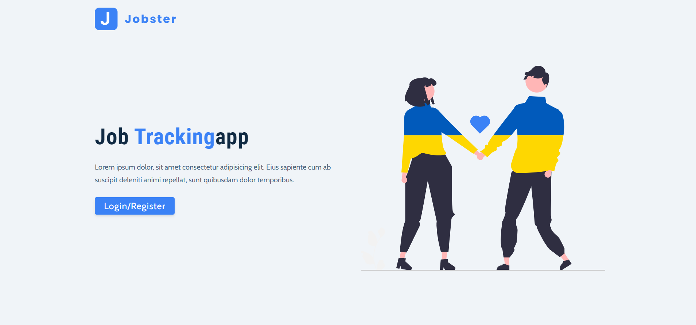
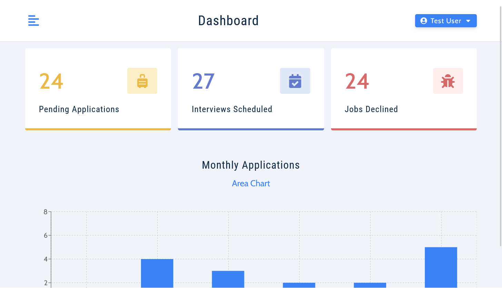
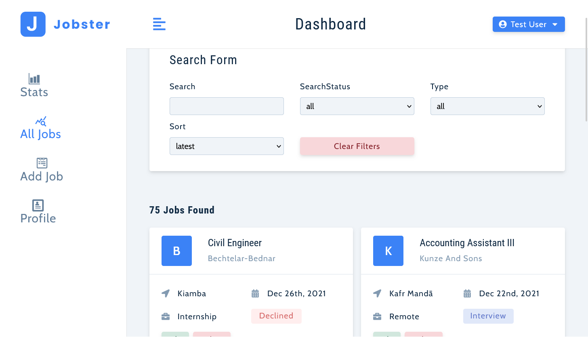

# Job Tracker Platform

## Overview

The Job Tracker Platform is a web application that helps users manage their job applications. Users can easily keep track of their applied jobs, filter them based on various criteria, and visualize application trends through interactive graphs. The project is built using React and Redux for state management.

This project was collaboratively developed by Emmanuel Daniel and John Smilga. It incorporates the expertise and guidance provided by both contributors.

## Features

- User-friendly interface to add, update, and delete job applications.
- Dynamic filtering options to easily sort and find specific job applications.
- Interactive graphs that provide insights into the overall job application progress.
- Efficient state management with Redux for a seamless user experience.

## Installation

1. Clone the repository: git clone https://github.com/your-username/job-tracker-platform.git

2. Navigate to the project directory: cd job-tracker-platform

3. Install the dependencies: npm install

4. Start the development server: npm start

## Usage

1. Open your web browser and navigate to `http://localhost:3000`.
2. Use the intuitive interface to add, edit, and delete job applications.
3. Utilize the filtering options to organize and view your applications efficiently.
4. Explore the graphs to gain insights into your job application trends.

## Technologies Used

- React: A JavaScript library for building user interfaces.
- Redux: A state management library for managing application state.
- Styled Components: A Css library
- Chart.js: A popular library for creating interactive charts and graphs.
- ... (List any other technologies or libraries you used)

## Screenshots

